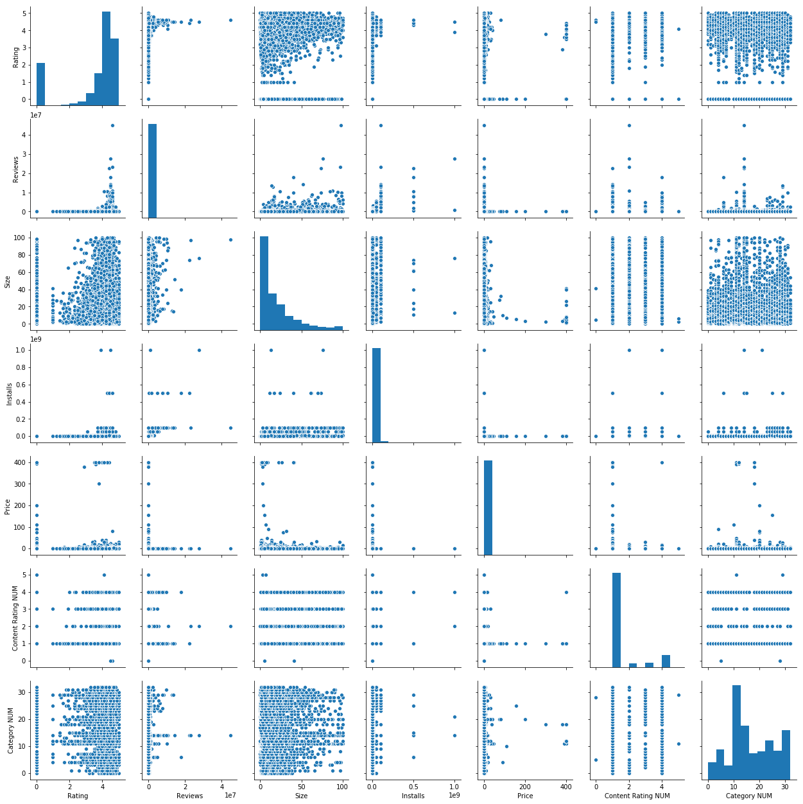

# DATA ANALYSIS AND GOOGLE APP RATING PREDICTION
WITH HELP OF PANDAS, NUMPY, SKLEARN, MATPLOTLIB AND SEABORN. I ANALYSE THE INSIGHT OF GOOGLE APP DATA. USING RANDOM FOREST WE CAN PREDICT THE RATING OF GIVEN APP'S ON THE BASIS OF 'Category NUM', 'Reviews', 'Size', 'Installs', 'Price', 'Content Rating NUM' AS FEATURES AND OTHER ON IS GIVEN RATING IN THAT CSV FILE. MEAN ABSOLUTE ERROR VALUE
AS ACCURACY SCORE.

BARPLOT OF FEATURE :--

FROM THE PAIR PLOTS WE CAN CONCLUDE :--

1. AS PRICE INCREASES INSTALLATION DECREASES.
2. INSTALLATION ON THE BASIS OF SIZE AS SIZE DECREASES THE POSSIBILITY INSTALLATION IS INCREASES.
3. MOST REVIEW FOR THE SMALLER SIZE APPLICATION.
4. WITH HELP OF RATING THEIR INSTALLATION'S ARE ALSO INCREASE.
